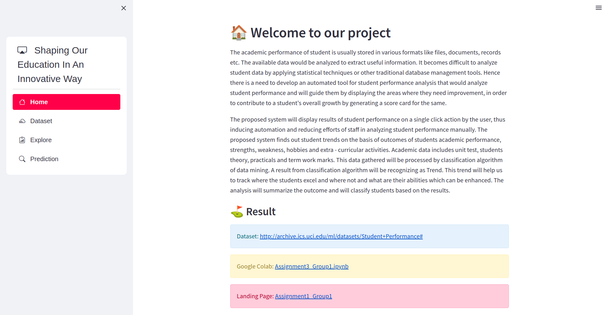
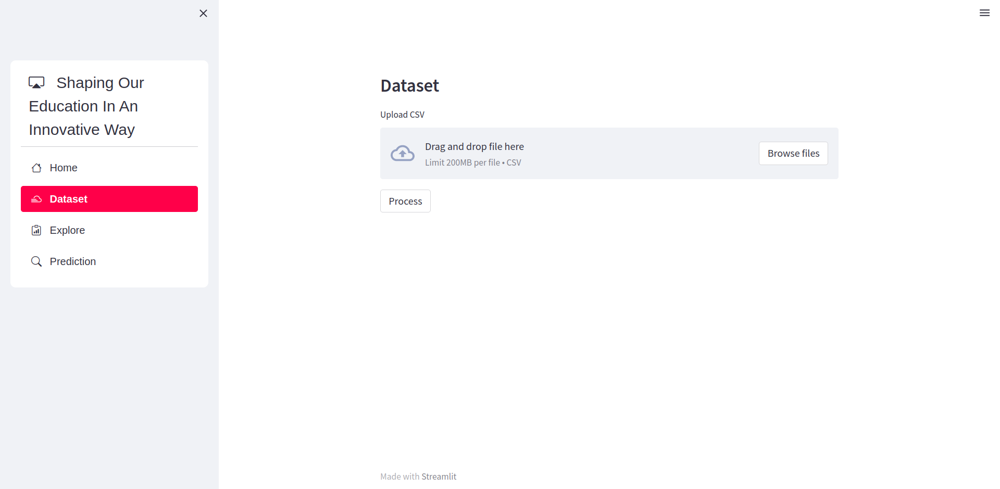
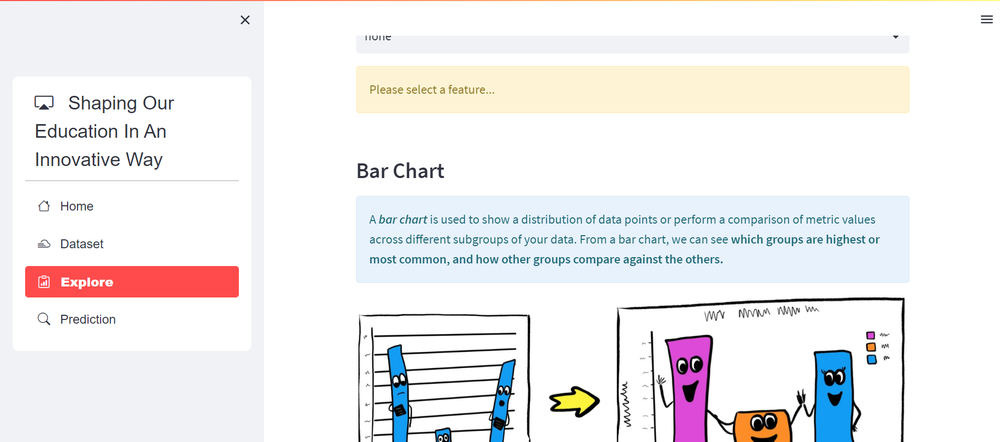
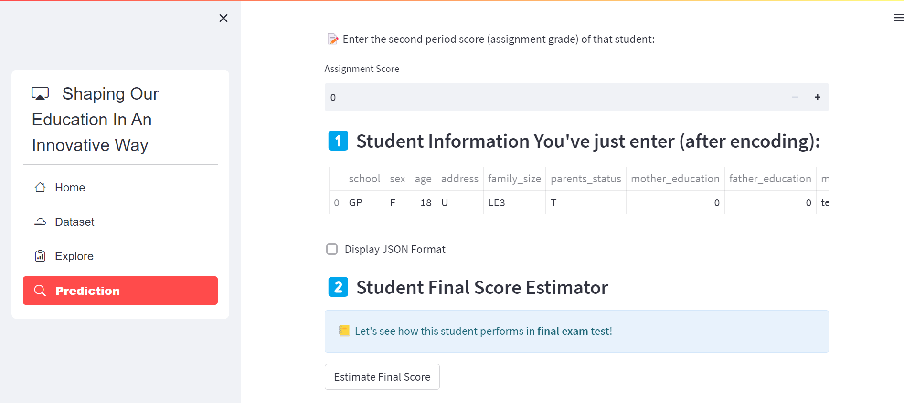

# Educational ML Website
The proposed system will display results of student performance on a single click action by the user, thus inducing automation and reducing efforts of staff in analyzing student performance manually. 

The proposed system finds out student trends on the basis of outcomes of students academic performance, strengths, weakness, hobbies and extra - curricular activities. Academic data includes unit test, students theory, practicals and term work marks. This data gathered will be processed by classification algorithm of data mining.

# ⛳ Result
* Dataset: [http://archive.ics.uci.edu/ml/datasets/Student+Performance#](http://archive.ics.uci.edu/ml/datasets/Student+Performance#)
* Google Colab: [Assignment3_Group1.ipynb](https://drive.google.com/file/d/1oVoCSEIr0IWa3FSdN6mM_LvmH2UAiV65/view?usp=sharing)
* Landing Page: [Assignment1_Group1](http://anduckhmt146.me/BDC_Assignment1/)

# :house: Home Page

# 🔢 Dataset Page

# 🔎 Explore Page

# 🔥 Prediction Page

